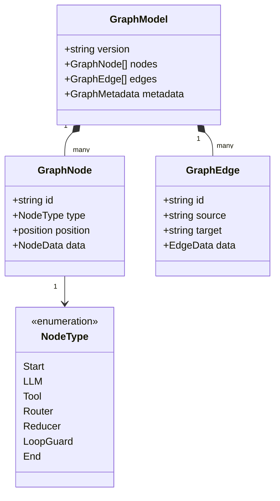
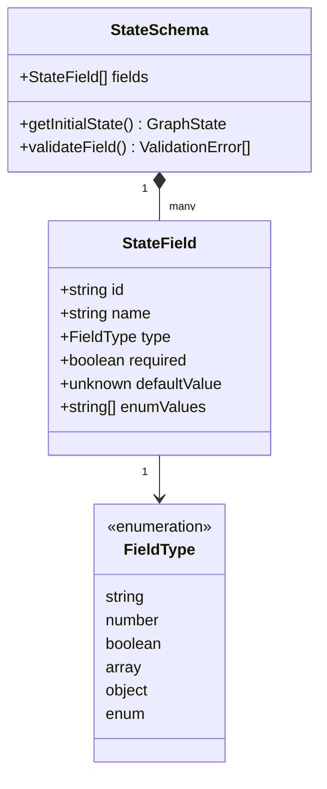
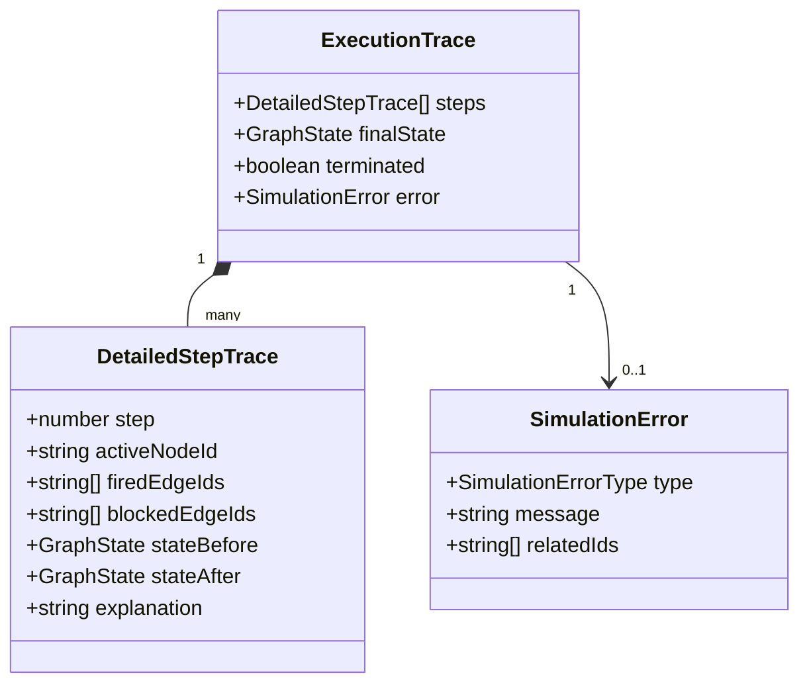
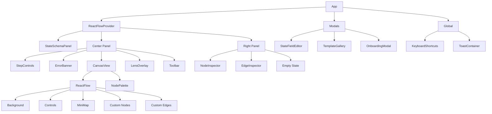

# LangGraph Visual Modeler - Architecture

## Overview

LangGraph Visual Modeler is a deterministic, explainable visual modeling environment for LangGraph applications. Design node-edge graphs on a canvas and simulate execution step-by-step—no backend required.

```
┌─────────────────────────────────────────────────────────────────────┐
│                        LANGGRAPH VISUAL MODELER                      │
├─────────────────────────────────────────────────────────────────────┤
│                                                                     │
│  ┌──────────┐    ┌─────────────┐    ┌──────────┐    ┌─────────────┐│
│  │   UI     │───▶│   STORES    │◀───│ SERVICES │◀───│   MODELS    ││
│  │ LAYER    │    │  (Zustand)  │    │          │    │ (TypeScript)││
│  └──────────┘    └─────────────┘    └──────────┘    └─────────────┘│
│       │                  │                  │                  │     │
│       ▼                  ▼                  ▼                  ▼     │
│  ┌──────────┐    ┌─────────────┐    ┌──────────┐    ┌─────────────┐│
│  │ React   │    │  GraphStore │    │ SimEngine│    │  GraphModel  ││
│  │ Flow    │    │ StateStore  │    │ Condition│    │ StateSchema  ││
│  │ Canvas  │    │ SimStore    │    │ Validator│    │ExecutionTrace││
│  └──────────┘    └─────────────┘    └──────────┘    └─────────────┘│
│                                                                     │
└─────────────────────────────────────────────────────────────────────┘
```

---

## Table of Contents

1. [Tech Stack](#tech-stack)
2. [Project Structure](#project-structure)
3. [Data Models](#data-models)
4. [Store Architecture](#store-architecture)
5. [Services](#services)
6. [Feature Modules](#feature-modules)
7. [Data Flow](#data-flow)
8. [Core Algorithms](#core-algorithms)
9. [Component Hierarchy](#component-hierarchy)
10. [Determinism Rules](#determinism-rules)

---

## Tech Stack

| Layer | Technology | Purpose |
|-------|-----------|---------|
| Frontend | React 18 + TypeScript | UI framework + type safety |
| Build | Vite | Fast dev server, HMR, bundling |
| Canvas | React Flow | Node-edge graph modeling |
| State | Zustand | Lightweight state management |
| Virtualization | @tanstack/react-virtual | Large list performance |
| Storage | localStorage | Auto-save persistence |
| Validation | Client-side rule engine | Graph/state validation |
| Testing | Vitest + Playwright | Unit + E2E tests |

---

## Project Structure

```
src/
├── app/                          # Root components
│   ├── App.tsx                  # Main 3-column layout
│   ├── main.tsx                 # Entry point
│   ├── index.css                # Global styles + CSS vars
│   ├── KeyboardShortcuts.tsx    # Global key bindings
│   └── OnboardingModal.tsx      # First-time user guide
│
├── models/                       # Core data models
│   ├── graph.ts                 # Graph, Node, Edge types
│   ├── state.ts                 # State schema types
│   ├── simulation.ts            # Simulation trace types
│   └── template.ts              # Template system types
│
├── store/                        # Zustand state management
│   ├── graphStore.ts            # Nodes, edges, selection
│   ├── stateStore.ts            # State schema fields
│   ├── simulationStore.ts       # Execution trace state
│   └── uiStore.ts               # Modal visibility, toasts
│
├── services/                     # Business logic
│   ├── SimulationEngine.ts      # Core simulation algorithm
│   ├── conditionEvaluator.ts    # Edge condition parser
│   ├── simulationValidator.ts   # Graph validation
│   └── templateLoader.ts        # Template management
│
├── features/                     # Feature modules
│   ├── canvas/                  # React Flow integration
│   │   ├── CanvasView.tsx       # Main canvas component
│   │   ├── nodes/               # Custom node renderers
│   │   ├── edges/               # Custom edge components
│   │   ├── NodePalette.tsx      # Draggable node types
│   │   ├── NodeInspector.tsx    # Node property editor
│   │   └── EdgeInspector.tsx    # Edge condition editor
│   │
│   ├── state/                   # State schema editor
│   │   ├── StateSchemaPanel.tsx
│   │   ├── StateFieldEditor.tsx
│   │   └── EnumValuesEditor.tsx
│   │
│   ├── sim/                     # Simulation controls
│   │   ├── StepControls.tsx     # Play/pause/step/reset
│   │   ├── TraceListPanel.tsx   # Execution history
│   │   └── StateSnapshotViewer.tsx
│   │
│   ├── lens/                    # Visual enhancement layer
│   │   ├── LensOverlay.tsx
│   │   └── LensToggle.tsx
│   │
│   ├── gallery/                 # Template gallery
│   │   ├── TemplateGallery.tsx
│   │   └── TemplateCard.tsx
│   │
│   └── io/                      # Import/export
│       ├── Toolbar.tsx
│       ├── exportJson.ts
│       └── importJson.ts
│
├── components/                   # Shared UI
│   └── Toast.tsx                # Notification system
│
└── assets/
    └── templates/               # Pre-built graph templates
```

---

## Data Models

### Graph Model



**7 Node Types:**

```
┌────────────────────────────────────────────────────────┐
│                    NODE TYPES                          │
├────────────────────────────────────────────────────────┤
│                                                        │
│  ┌──────────────────┐  ┌──────────────────┐           │
│  │      START       │  │       LLM        │           │
│  │   ▶  Begin       │  │  🤖  AI Call     │           │
│  └──────────────────┘  └──────────────────┘           │
│                                                        │
│  ┌──────────────────┐  ┌──────────────────┐           │
│  │      TOOL        │  │     ROUTER       │           │
│  │  🔧  Function    │  │  🔀  Branching   │           │
│  └──────────────────┘  └──────────────────┘           │
│                                                        │
│  ┌──────────────────┐  ┌──────────────────┐           │
│  │    REDUCER       │  │   LOOPGUARD      │           │
│  │  📊  Aggregate   │  │  🛡️  Loop Ctrl   │           │
│  └──────────────────┘  └──────────────────┘           │
│                                                        │
│  ┌──────────────────┐                                   │
│  │      END         │                                   │
│  │   ■  Terminate   │                                   │
│  └──────────────────┘                                   │
└────────────────────────────────────────────────────────┘
```

**Key Types:**

```typescript
// Node Types
type NodeType = 'Start' | 'LLM' | 'Tool' | 'Router' | 'Reducer' | 'LoopGuard' | 'End';

// Node Structure
interface GraphNode {
  id: string;                    // Auto-generated: node-{type}-{timestamp}-{random}
  type: NodeType;
  position: { x: number; y: number };
  data: {
    label: string;
    config?: Record<string, unknown>;
  };
}

// Edge Structure
interface GraphEdge {
  id: string;                    // Auto-generated: edge-{source}-{target}-{timestamp}
  source: string;
  target: string;
  data?: {
    condition?: string;          // e.g., 'state.status === "success"'
    label?: string;
  };
}
```

### State Schema Model



### Simulation Model



---

## Store Architecture

### Store Overview

```
┌─────────────────────────────────────────────────────────────┐
│                      ZUSTAND STORES                          │
├─────────────────────────────────────────────────────────────┤
│                                                             │
│  ┌─────────────────┐  ┌─────────────────┐  ┌─────────────┐ │
│  │   GraphStore    │  │   StateStore    │  │  SimStore  │ │
│  │                 │  │                 │  │             │ │
│  │ • nodes         │  │ • fields        │  │ • trace    │ │
│  │ • edges         │  │ • validation    │  │ • playing  │ │
│  │ • selectedId    │  │ • initialState  │  │ • speed    │ │
│  │ • metadata      │  │                 │  │ • error    │ │
│  │ • lensEnabled   │  │                 │  │             │ │
│  └─────────────────┘  └─────────────────┘  └─────────────┘ │
│                                                                 │
│  ┌─────────────────┐                                            │
│  │   uiStore       │                                            │
│  │   (prefs)       │                                            │
│  └─────────────────┘                                            │
└─────────────────────────────────────────────────────────────┘
```

### Graph Store

**Purpose:** Manages graph nodes, edges, and React Flow integration

```typescript
interface GraphStore {
  // State
  nodes: Node[];
  edges: Edge[];
  metadata: GraphModel['metadata'];
  selectedNodeId: string | null;
  selectedEdgeId: string | null;
  lensEnabled: boolean;
  galleryOpen: boolean;

  // Actions
  addNode: (type: NodeType, position: {x,y}) => void;
  updateNode: (id: string, data: Partial) => void;
  deleteNode: (id: string) => void;
  updateEdge: (id: string, data: Partial) => void;
  deleteEdge: (id: string) => void;
  loadGraph: (graph: GraphModel) => void;
  exportGraph: () => GraphModel;
  clearGraph: () => void;
}
```

**Persistence Flow:**

```
User Action → Store Update → Subscribe → persistGraphStore()
                                                   │
                                                   ▼
                                            ┌───────────────┐
                                            │ Size Check    │
                                            │ (4MB limit)   │
                                            └───────────────┘
                                                   │
                                    ┌──────────────┴──────────────┐
                                    │                             │
                                    ▼                             ▼
                              ┌──────────┐                  ┌──────────┐
                              │ Save to  │                  │ Show     │
                              │localStorage               │ Error    │
                              └──────────┘                  └──────────┘
```

### State Store

```typescript
interface StateStore {
  fields: StateField[];
  validationErrors: Map<string, string>;

  getInitialState: () => GraphState;
  addField: (field: Omit<StateField, 'id'>) => void;
  updateField: (id: string, data: Partial<StateField>) => void;
  deleteField: (id: string) => void;
  validateField: (field: StateField) => string | null;
}
```

### Simulation Store

```typescript
interface SimulationStore {
  trace: SimulationTrace;           // UI-friendly trace
  executionTrace: ExecutionTrace;   // Detailed engine trace
  isPlaying: boolean;
  speed: number;
  error: SimulationError | null;

  stepForward: () => void;
  stepBackward: () => void;
  jumpToStep: (stepIndex: number) => void;
  runSimulation: (graph: GraphModel, initialState?) => void;
  reset: () => void;
}
```

---

## Services

### Service Architecture

```
┌─────────────────────────────────────────────────────────────┐
│                     SERVICES LAYER                          │
├─────────────────────────────────────────────────────────────┤
│                                                             │
│  ┌──────────────────┐  ┌──────────────────┐                │
│  │ SimulationEngine │  │ConditionEvaluator│                │
│  │                  │  │                  │                │
│  │ • run()          │  │ • evaluate()     │                │
│  │ • executeNode()  │  │ • explain()      │                │
│  │ • selectNext()   │  │ • resolveValue() │                │
│  └──────────────────┘  └──────────────────┘                │
│                                                             │
│  ┌──────────────────┐  ┌──────────────────┐                │
│  │  GraphValidator  │  │ TemplateLoader   │                │
│  │                  │  │                  │                │
│  │ • validate()     │  │ • loadTemplate() │                │
│  │ • findCycles()   │  │ • listTemplates()│                │
│  │ • checkReachable()│  │                 │                │
│  └──────────────────┘  └──────────────────┘                │
└─────────────────────────────────────────────────────────────┘
```

### Simulation Engine

Deterministic execution with:
- Step-by-step execution
- Edge ordering (sorted by ID for consistency)
- Cycle detection via DFS path tracking
- Router: fires first matching edge only
- LoopGuard: fires first match or blocks all

### Condition Evaluator

Safe (no `eval`) condition parsing:
- State field access: `state.messages`
- Comparisons: `===`, `!=`, `>`, `<`, `>=`, `<=`, `in`
- Logical: `&&`, `||`, `!`
- Regex-based pattern matching

### Graph Validator

Pre-simulation checks:
- At least one Start node
- At least one End node
- No orphaned edges (source/target must exist)
- No duplicate node IDs
- Reachability analysis (BFS)
- Cycle detection (DFS)

---

## Feature Modules

### Canvas Module

```
┌─────────────────────────────────────────────────────────────┐
│                    CANVAS MODULE                            │
├─────────────────────────────────────────────────────────────┤
│                                                             │
│  ┌─────────────┐         ┌───────────────────┐             │
│  │ NodePalette │────────▶│   CanvasView      │             │
│  │             │         │   (React Flow)    │             │
│  │ • Start     │         │                   │             │
│  │ • LLM       │         │  ┌─────┐ ┌─────┐  │             │
│  │ • Tool      │         │  │Node1│─▶│Node2│  │             │
│  │ • Router   │         │  └─────┘ └─────┘  │             │
│  │ • Reducer   │         │                   │             │
│  │ • LoopGuard │         │  ┌───────────┐    │             │
│  │ • End       │         │  │ MiniMap   │    │             │
│  └─────────────┘         │  └───────────┘    │             │
│                          └───────────────────┘             │
│                                  │                         │
│                         ┌────────┴────────┐                │
│                         │                 │                │
│                         ▼                 ▼                │
│                  ┌──────────┐      ┌──────────┐           │
│                  │  Node    │      │  Edge    │           │
│                  │Inspector │      │Inspector │           │
│                  └──────────┘      └──────────┘           │
└─────────────────────────────────────────────────────────────┘
```

### State Module

```
┌─────────────────────────────────────────────────────────────┐
│                    STATE SCHEMA PANEL                       │
├─────────────────────────────────────────────────────────────┤
│                                                             │
│  State Fields                                  [+ Add Field]│
│  ┌─────────────────────────────────────────────────────┐   │
│  │ 📝 input               │ string  │ required  [✏️][🗑️]│   │
│  │    User input text                              │   │
│  ├─────────────────────────────────────────────────────┤   │
│  │ 🔢 count               │ number  │ optional [✏️][🗑️]│   │
│  │    Iteration count                             │   │
│  ├─────────────────────────────────────────────────────┤   │
│  │ ✅ enabled             │ boolean │ default  [✏️][🗑️]│   │
│  │    Feature flag                                │   │
│  └─────────────────────────────────────────────────────┘   │
└─────────────────────────────────────────────────────────────┘
```

### Simulation Module

```
┌─────────────────────────────────────────────────────────────┐
│                  SIMULATION CONTROLS                        │
├─────────────────────────────────────────────────────────────┤
│                                                             │
│  ┌─────────────────────────────────────────────────────┐   │
│  │  ◀◀   ▶   ⏸️   ▶▶          Speed: [1x]              │   │
│  │ Step -1 Play/Pause Step +1      ▼                     │   │
│  └─────────────────────────────────────────────────────┘   │
│                                                             │
│  ┌─────────────────────────────────────────────────────┐   │
│  │  TRACE LIST                              Step: 3/10  │   │
│  ├─────────────────────────────────────────────────────┤   │
│  │ • Step 0: Start node executing               [idle]  │   │
│  │ • Step 1: LLM node processing                [idle]  │   │
│  │ • Step 2: Router selecting path              [idle]  │   │
│  │ → Step 3: Tool node executing               [active]│   │
│  │   • Step 4: End node                        [future]│   │
│  └─────────────────────────────────────────────────────┘   │
└─────────────────────────────────────────────────────────────┘
```

---

## Data Flow

### User Action Flow

```
USER INPUT
    │
    ▼
┌───────────┐
│ REACT FLOW│
│  Canvas   │
└───────────┘
    │
    ▼
┌───────────┐
│  EVENT    │
│ HANDLERS  │
└───────────┘
    │
    ├──────────┬───────────┬──────────┐
    ▼          ▼           ▼          ▼
┌──────┐ ┌──────────┐ ┌────────┐ ┌────────┐
│ Drag │ │ Connect  │ │ Select │ │ Delete │
│ Node │ │  Edge    │ │Element │ │Element │
└──────┘ └──────────┘ └────────┘ └────────┘
    │          │           │          │
    └──────────┴───────────┴──────────┘
               │
               ▼
    ┌─────────────┐
    │ GraphStore  │
    │   Actions   │
    └─────────────┘
               │
               ▼
    ┌─────────────┐
    │  State      │
    │  Updated    │
    └─────────────┘
               │
               ▼
    ┌─────────────┐
    │  React      │
    │  Re-render  │
    └─────────────┘
```

### Simulation Execution Flow

```
USER CLICKS "RUN"
        │
        ▼
┌────────────────────────────────┐
│ runSimulation(graph, state)    │
└────────────────────────────────┘
        │
        ▼
┌────────────────────────────────┐
│ new SimulationEngine(graph,    │
│   {initialState, maxSteps})    │
└────────────────────────────────┘
        │
        ▼
┌────────────────────────────────┐
│ BUILD EDGE MAP                 │
│ Sort edges by ID (ascending)   │
└────────────────────────────────┘
        │
        ▼
┌────────────────────────────────┐
│ MAIN LOOP                      │
│ while (!terminated &&          │
│        stepCount < maxSteps)   │
│                                │
│ 1. Check cycle detection       │
│ 2. Execute current node        │
│ 3. Evaluate outgoing edges     │
│ 4. Select next node            │
│ 5. Create trace step           │
│ 6. Update state                │
└────────────────────────────────┘
        │
        ▼
┌────────────────────────────────┐
│ RETURN EXECUTION TRACE         │
│ {steps, finalState, error}     │
└────────────────────────────────┘
        │
        ▼
┌────────────────────────────────┐
│ UPDATE SIMULATION STORE        │
│ UI UPDATES                     │
└────────────────────────────────┘
```

---

## Core Algorithms

### Simulation Algorithm

```
FUNCTION run(): ExecutionTrace

1. INITIALIZATION
   steps = []
   stepCount = 0
   startNode = findNode('Start')
   IF !startNode RETURN error: no_start

   currentState = initialState || {}
   currentNodeId = startNode.id
   visitedInPath = Set()

2. MAIN LOOP
   WHILE !terminated AND stepCount < maxSteps:

     A. CYCLE DETECTION
        IF visitedInPath.has(currentNodeId):
          RETURN error: cycle

     B. GET CURRENT NODE
        node = nodeMap.get(currentNodeId)
        visitedInPath.add(currentNodeId)

     C. EXECUTE NODE
        stateBefore = {...currentState}
        stateAfter = executeNode(node, stateBefore)

     D. SELECT NEXT NODE
        outgoing = edgeMap.get(node.id)
        result = selectNextNode(node, outgoing, stateAfter)

     E. CREATE TRACE STEP
        steps.push({
          step: stepCount,
          activeNodeId: node.id,
          stateBefore, stateAfter,
          firedEdgeIds: result.firedEdgeIds,
          explanation: result.explanation
        })

     F. UPDATE STATE
        currentState = stateAfter
        stepCount += 1

     G. CHECK TERMINATION
        IF node.type == 'End': terminated = true
        IF !nextNodeId: terminated = true
        currentNodeId = nextNodeId

     H. PATH MANAGEMENT
        IF node NOT IN ['Router', 'LoopGuard']:
          visitedInPath.clear()

3. RETURN TRACE
   RETURN {steps, finalState, terminated, error}
```

### Edge Selection by Node Type

```
ROUTER:
  FOR EACH edge (sorted by ID):
    IF edge.condition == TRUE:
      RETURN {nextNodeId: edge.target, fired: [edge.id]}
  RETURN {nextNodeId: null}  // No match = dead end

LOOPGUARD:
  FOR EACH edge (sorted by ID):
    IF edge.condition == TRUE:
      RETURN {nextNodeId: edge.target, fired: [edge.id]}
  RETURN {nextNodeId: null}  // No match = block all

DEFAULT (Start, LLM, Tool, Reducer):
  FOR EACH edge (sorted by ID):
    IF edge.condition == TRUE:
      RETURN {nextNodeId: edge.target, fired: [edge.id]}
  RETURN {nextNodeId: null}
```

### Condition Evaluation (Safe, No eval)

```
FUNCTION evaluateCondition(condition, state): boolean

1. EMPTY CHECK
   IF !condition: RETURN true

2. PATTERN MATCHING
   === : resolveValue(left) == resolveValue(right)
   !=  : resolveValue(left) != resolveValue(right)
   >   : Number(resolveValue(left)) > Number(right)
   <   : Number(resolveValue(left)) < Number(right)
   >=  : Number(resolveValue(left)) >= Number(right)
   <=  : Number(resolveValue(left)) <= Number(right)
   in  : Array(right).includes(left)
   &&  : evaluateCondition(left) && evaluateCondition(right)
   ||  : evaluateCondition(left) || evaluateCondition(right)
   !   : !evaluateCondition(inner)

3. VALUE RESOLUTION
   state.field  → getNestedValue(state, 'field')
   "literal"   → string value
   123         → number value
   true/false  → boolean value
```

### Cycle Detection

```
visitedInPath: Set<string> = new Set()

AT EACH NODE:
  IF visitedInPath.has(currentNodeId):
    RETURN error: cycle

  visitedInPath.add(currentNodeId)

  IF node.type NOT IN ['Router', 'LoopGuard']:
    visitedInPath.clear()
    // Allows revisiting through different paths
```

### Graph Validation

```
FUNCTION validateGraph(graph): ValidationError[]

1. STRUCTURE
   IF NO Start nodes: error
   IF NO End nodes: error

2. UNIQUENESS
   IF duplicate node IDs: error

3. ORPHAN EDGES
   FOR EACH edge:
     IF source node missing: error
     IF target node missing: error

4. REACHABILITY (BFS)
   queue = [Start nodes]
   visited = Set()
   WHILE queue:
     current = queue.shift()
     FOR EACH outgoing edge:
       IF target NOT visited: queue.push(target)
   unreachable = nodes NOT in visited

5. CYCLES (DFS)
   recursionStack = Set()
   FOR EACH node:
     IF dfs(node) HAS cycle: record cycle
```

---

## Component Hierarchy

### App Layout

```
┌──────────────────────────────────────────────────────────────────┐
│                           APP (Root)                             │
├──────────────────────────────────────────────────────────────────┤
│                                                                  │
│  ┌──────────────┬────────────────────────────┬─────────────────┐│
│  │   Left       │        Center Panel         │    Right        ││
│  │   Panel      │                            │    Panel        ││
│  │   (280px)    │                            │    (320px)      ││
│  │              │                            │                 ││
│  │ ┌──────────┐ │ ┌────────────────────────┐ │ ┌─────────────┐ ││
│  │ │  State   │ │ │   SimControls (cond.)   │ │ │  Inspector  │ ││
│  │ │  Schema  │ │ └────────────────────────┘ │ │  (dynamic)  │ ││
│  │ │  Panel   │ │                            │ │             │ ││
│  │ │          │ │ ┌────────────────────────┐ │ │ ┌─────────┐ ││
│  │ │          │ │ │   ErrorBanner          │ │ │ │ Node    │ ││
│  │ │          │ │ └────────────────────────┘ │ │ │Inspector│ ││
│  │ │          │ │                            │ │ │         │ ││
│  │ │          │ │ ┌────────────────────────┐ │ │ └─────────┘ ││
│  │ │          │ │ │   CanvasView          │ │ │             ││
│  │ │          │ │ │   (ReactFlow)         │ │ │ ┌─────────┐ ││
│  │ │          │ │ │  ┌────┐ ┌────┐        │ │ │ │ Edge    │ ││
│  │ │          │ │ │  │Node│─▶│Node│       │ │ │ │Inspector│ ││
│  │ │          │ │ │  └────┘ └────┘        │ │ │ │         │ ││
│  │ │          │ │ │  ┌──────────────┐     │ │ │ └─────────┘ ││
│  │ │          │ │ │  │  MiniMap     │     │ │ │             ││
│  │ │          │ │ │  └──────────────┘     │ │ │ OR          ││
│  │ │          │ │ └────────────────────────┘ │ │ ┌─────────┐ ││
│  │ │          │ │                            │ │ │  Empty  │ ││
│  │ │          │ │ ┌────────────────────────┐ │ │ │  State  │ ││
│  │ │          │ │ │   LensOverlay          │ │ │ └─────────┘ ││
│  │ │          │ │ └────────────────────────┘ │ │             ││
│  │ │          │ │                            │ │             ││
│  │ │          │ │ ┌────────────────────────┐ │ │             ││
│  │ │          │ │ │   Toolbar             │ │ │             ││
│  │ │          │ │ └────────────────────────┘ │ │             ││
│  │ └──────────┘ │                            │ └─────────────┘│
│  └──────────────┴────────────────────────────┴─────────────────┘│
│                                                                  │
│  Modals: StateFieldEditor | TemplateGallery | Onboarding        │
│  Global: KeyboardShortcuts | ToastContainer                     │
└──────────────────────────────────────────────────────────────────┘
```

### Component Tree



---

## Determinism Rules

For consistent, reproducible execution:

1. **Edge Execution Order**
   - Edges sorted by ID (ascending) before execution
   - Same graph + same state = same execution path

2. **Router Behavior**
   - Fires FIRST matching edge ONLY
   - Does NOT evaluate remaining edges once match found

3. **LoopGuard Behavior**
   - Fires FIRST matching edge OR blocks ALL
   - No match = execution terminates

4. **Path Tracking**
   - `visitedInPath` cleared when leaving non-routing nodes
   - Allows revisiting nodes through different paths
   - Prevents infinite loops within same path

---

## Performance Optimizations

1. **Memoization**
   - All node/edge renderers use `React.memo`
   - Prevents unnecessary re-renders

2. **Virtualization**
   - State panel uses `@tanstack/react-virtual`
   - Efficiently handles large field lists

3. **React Flow Optimizations**
   - `nodeDragThreshold={2}` - prevents accidental drags
   - `selectNodesOnDrag={false}` - separate selection from drag
   - `onlyRenderVisibleElements` - viewport culling

4. **Zustand Selectors**
   - Selector-based subscriptions
   - Components only re-render on relevant state changes

---

## Extension Points

1. **New Node Types**
   - Add to `NodeType` union in [`graph.ts`](src/models/graph.ts)
   - Create renderer in [`features/canvas/nodes/`](src/features/canvas/nodes/)
   - Add behavior to [`SimulationEngine.ts`](src/services/SimulationEngine.ts)

2. **Custom Edge Conditions**
   - Extend [`conditionEvaluator.ts`](src/services/conditionEvaluator.ts)
   - Add regex patterns for new operators

3. **Real LLM Integration**
   - Replace mock in [`SimulationEngine.executeNode()`](src/services/SimulationEngine.ts)
   - Add API call to LLM provider

4. **Custom Storage**
   - Implement alternative to [`persistGraphStore()`](src/store/graphStore.ts)
   - Add backend sync, file export, etc.

---

*LangGraph Visual Modeler v1.0*
